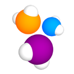

#   Автотест страницы X5Group 

[](https://www.x5.ru/ru/)

<h2>  Cтек </h2>
<p align="center">
  <a href="https://www.jetbrains.com/idea/"> </a>
  <a href="https://selenide.org/"> </a>
  <a href="https://aerokube.com/selenoid/"> </a>
  <a href="https://gradle.org/"> </a>
  <a href="https://github.com/allure-framework/allure2"> </a>
  <a href="https://github.com/"></a> 
  <a href="https://telegram.org"></a>
  <a href="https://www.jenkins.io/"> </a>
  <a href="https://www.java.com/"></a>
  <a href="https://junit.org/junit5/"> </a>
</p>

## Проверки
- *Проверка разделов:*
- - *Планирование*
- - *Покупки*
- - *Доставка*
- - *Сервисы*
- - *Партнерам*
- - *Инвесторам*
- *Проверка поиска*
- *Проверка наличие подменю в меню:*
- - *Компания*
- - *Партнерам*
- - *Инвесторам*
- - *Пресс-центр*
- *Проверка кликабельности чекбоксов:*
- - *Я сотрудник*
- - *Я бывшый сотрудник*
- - *Я не сотрудник*

 
##  Сборка в Jenkins    
<p align="center">

 </p>

## Запуск тестов

__*Локально, из терминала:*__
```
gradle clean x5GroupTests
```
__*Удаленно, из Jenkins:*__
```
clean
${TASK}
-Dbrowser=${Browser}
-DbrVersion=${BrVersion}
-DbrSize=${BrSize}
-DbaseUrl=${BaseUrl}
-Dselenoid=${Selenoid}
-DselenoidRemote=${SelenoidRemote}
```
## Отчет о прохождении тестов в Allure и Telegram

<h2> №1 Тест главной страницы </h2>

|         Allure         |  Allure |
|:-------------------------------------------------------------------------------------------:|:------------------------------------------------------------------------:|

<p align="center">
Telegram
</p>
<p align="center">
                                                                            
 </p>

###  Видео теста на Selenoid


https://user-images.githubusercontent.com/105595414/225107084-5e28cb85-46b2-4166-a95b-b73f16108ce7.mp4


<h2> №2 Тест поиска </h2>

| Allure|  Allure|
|:---:|:---:|
| Telegram||

###  Видео теста на Selenoid

https://user-images.githubusercontent.com/105595414/225115497-60e318ce-768a-444b-826a-a6d5e9131ca1.mp4


<h2> №3 Тест содержания меню </h2>

|  Allure  |  Allure |
|:-----------------------------------------------------------------------------------------------------------:|:--------:|
|  Telegram |    |

###  Видео теста на Selenoid

https://user-images.githubusercontent.com/105595414/225117313-c7a4cd03-4778-4437-a4c0-3cb6495ffd8d.mp4

<h2> №4 Тест кликабельности чекбоксов </h2>

| Allure| Allure|
|:---:|:---:|
| Telegram||

###  Видео теста на Selenoid

https://user-images.githubusercontent.com/105595414/225122657-60f841f9-0216-4920-83ca-64c76e8905ca.mp4

<h2> №5 прогон всех тестов </h2>

|       Allure      |          Allure          |
|:-----------------------------------------------------------------------------------------------:|:-------------------------------------------------------------------------------------------------------------:|
|    Telegram | |


